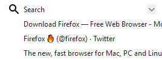
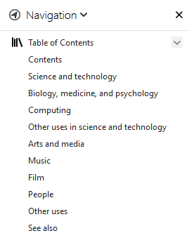

(see online version at https://bitbucket.org/pdulvp/webext-navigation/src/master/ )

# Navigation

This extension allows navigation on websites by adding a sidebar on browser.
It displays table of contents and for all compatible Accessible Rich Internet Applications, their defined navigation links.

On a search engine,

## Getting Started

On a search engine,

On a ARIA based site,

On regular web site, its table of content.

